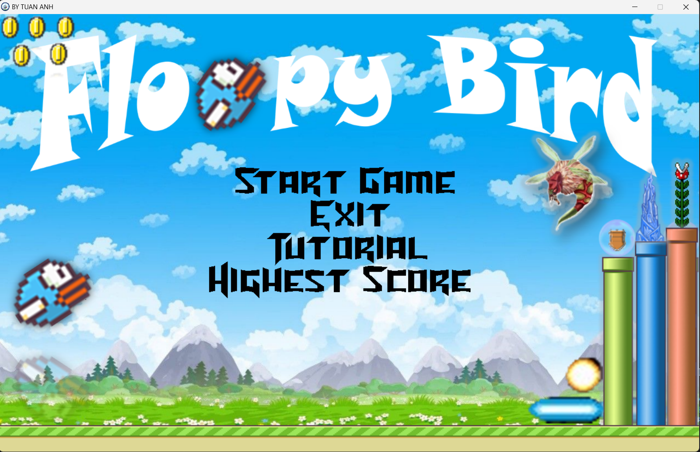
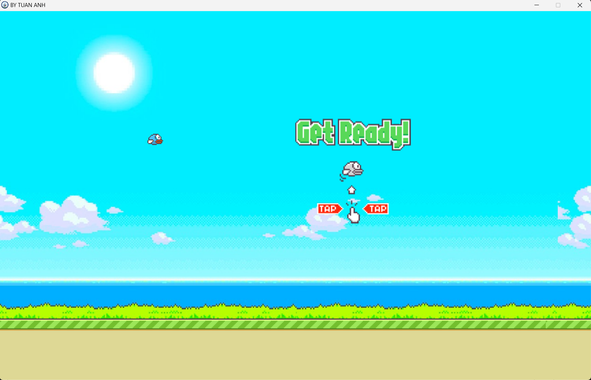
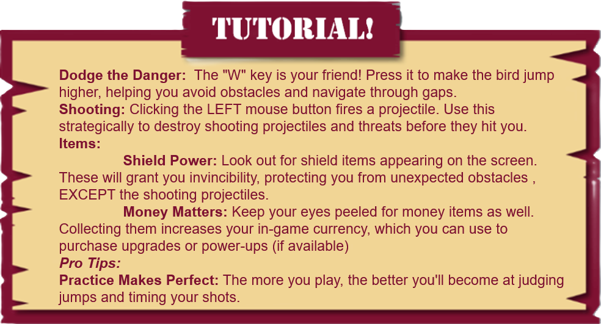
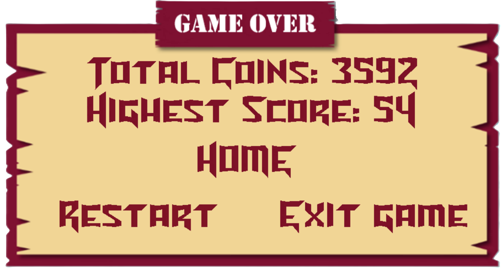
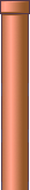
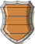

 # ***Floppy Bird*** 

## **Introduction** 

+ Họ và tên: Phạm Tuấn Anh - K68CB - UET

+ Mã sinh viên: 23020010 

+ Bài tập lớn: **Floppy Bird** (INT2215_50 - Lập trình nâng cao)
# Phụ lục
- [Description](#description)
  * [Game description and instruction](#game-description-and-instruction)
  * [Control](#control)
  * [Preview](#preview)
- [Objects In game](#objects-in-game)
- [Setup](#setup)
- [Play Game](#play-game)
- [See also](#see-also)
  * [Các kỹ thuật sử dụng](#các-kỹ-thuật-sử-dụng)
  * [Các nguồn tham khảo](#các-nguồn-tham-khảo)
- [Source Code Game](#source-code-game)
- [Conclusion](#conclusion)
  * [Điều tâm đắc](#điều-tâm-đắc)
  * [Hạn chế](#hạn-chế)
  * [Hướng phát triển](#hướng-phát-triển)
- [A Special Thanks To](#a-special-thanks-to)
- [Mức điểm tự đánh giá](#mức-điểm-tự-đánh-giá)

## **Description** 
### *Game description and instruction* 
- Đây là trò chơi được phát triển theo một hướng hoàn toàn khác với nhiều tính năng hay, vượt trội so với trò chơi Flappy Bird, được lập trình với thư viện SDL2.
- Bứt phá khỏi lối chơi truyền thống, **Floppy Bird** mang đến những tính năng độc đáo và Gameplay đầy hấp dẫn:
  + Thay vì chỉ tập trung vào việc điều khiển chim bay qua các chướng ngại vật, người chơi có thể sử dụng thêm tính năng bắn đạn để tiêu diệt chúng.
  + Việc kiếm tiền thưởng bằng cách ăn vàng và tiêu diệt chướng ngại vật tạo thêm động lực cho người chơi tiếp tục chơi.
  +  Có thêm các chướng ngại vật bất ngờ như cây ăn thịt và tảng băng rơi mang đến yếu tố thử thách và bất ngờ, khiến trò chơi trở nên gay cấn hơn.
  + Bên cạnh các chướng ngại vật, vật phẩm giúp người chơi chống lại các chướng ngại vật, tạo thêm lợi thế và tăng cơ hội tồn tại lâu hơn.
- Có âm thanh sôi động khi chơi game.
- Game có đầy đủ chức năng hỗ trợ người chơi trong việc điều chỉnh giữa các lựa chọn dừng game, chơi lại game, thoát game, mô tả cách chơi, sử dụng phím esc để dừng game,...
- **Floppy Bird** chắc chắn sẽ không khiến cho người chơi phải thất vọng với những tính năng, đồ họa độc đáo mới lạ.
- Video demo :
### *Control* 

| Control  |   Player   |
|----------|------------|
| UP       |      ↑     |
| W        |      ↑     |
| SHOOTING | BUTTONLEFT |

- **Button B**: swap bullet for bird.
- **Button M**: unmute/unmute music.
- **Button ESC** : pause game, or exit window menu.

### *Preview*
#### *Cửa sổ hiện thị màn hình Start Game*

#### *Cửa sổ hiện thị màn hình sẵn sàng chơi Game*

#### *Cửa sổ hiện thị hướng dẫn cơ bản cách chơi Game*

#### *Cửa sổ hiện thị ĐIỂM SỐ và TIỀN VÀNG khi Game Over*

## **Objects In game**
|                                         | Tên đối tượng 	       | Mô tả                                                                                        |
|-----------------------------------------|--------------------|--------------------------------------------------------------------------------------------------|
|  | Bird  | Nhân vật chính của game|
|  | Pipe Red| Ống nước màu đỏ là chướng ngại vật tiềm tàng ẩn chứa những vật cản bất ngờ|
|    | Pipe Green	   | Ông nước màu lục là chướng ngại vật|
|  | Pipe Blue	 | Ống nước màu lam là chướng ngại vật tiềm tàng ẩn chứa những vật cản bất ngờ|
|    | Threat| Quái ong có khả năng phóng mũi kim có độc |
|    | Unexpected Threat| Những vật cản bất ngờ |
|    | Money| Tiền thường |
|    | Power-ups Items| Vật phẩm bổ trợ cho nhân vật  |
|    | Shield| Lá chắn vật cản   |
|    | Pause Game Button | Nút dừng Game  |
|    | Play Game Button | Nút chơi tiếp  |
|    | Restart Game Button | Nút chơi lại   |
|    | Exit Game Button | Nút thoát Game  |

## **Setup**
- Yêu cầu : có C++ compiler.
    1. Tạo một New Folder bất kỳ, dùng terminal: $ git clone https://github.com/Dainn98/FloppyBird.git
    2. Vào thư mục vừa tải về và ấn đúp vào FloppyBird.
    3. Ấn đúp vào FloppyBird hoặc FloppyBird_backup, ấn đúp vào main.exe để chạy chương trình.
- *Mọi khó khăn trong phần cài đặt, trong quá trình chơi, vui lòng liên hệ qua 23020010@vnu.edu.vn.*

## **See also**  
### *Các kỹ thuật sử dụng*  
- Thư viện SDL2.0
- Sử dụng nhiều class, vector, tách file, con trỏ, xâu chuỗi,biến, vòng lặp, cấu trúc rẽ nhánh, mảng, ...
- Tạo nhiều đối tượng với từng class riêng: tiền, chướng ngại vật, đạn bắn, chim, vật phẩm, ...
- Có thể lưu lại điểm cao nhất sau mỗi lần chơi nhờ đọc và ghi file.
- Xử lý thời gian, thao tác chuột và bàn phím, âm thanh, hình ảnh, chữ.
- Tạo menu và các nút ấn di chuyển giữa các menu.
- Tạo Option khi chơi : pause game, play game, restart game, exit game.
- Sử dụng photoshop để edit các ảnh dựa vào một số mẫu ảnh từ các nguồn khác.
- Có sử dụng kiến thức toán học để tính toán va chạm của các đối tượng.

### *Các nguồn tham khảo*
- Cách sử dụng, cài đặt SDL2.0 trên C++: tham khảo từ các bạn, kênh youtube **TOAN - TIN IUH**.
- Cách sử dụng, thư viện SDL2.0, quản lý chương trình:
    + Tham khảo trên **LazyFoo**.
    + Các buổi học lý thuyết của **TS.Lê Đức Trọng**.
    + Các buổi học thực hành của **CN. Trần Trường Thủy**.
    + Kênh youtube: **Let's Make Games**, **PolyMars**, **Madsycode**.
- Hình ảnh: các nguồn trên google, pinterest,..
    + https://www.spriters-resource.com/mobile/flappybird/sheet/59894/
- Âm thanh: các nguồn trên google
  
    + https://pixabay.com/sound-effects/search/wav/
      * Free Wav Sound Effects Download
    + https://www.freesoundeffects.com/free-sounds/explosion-10070/
      * Free Explosion Sound Effects
## **Source Code Game**
- Folder *Sound*: Chứa toàn bộ âm thanh của trò chơi.
- Folder *Stats*: Chứa dữ liệu điểm và tiền thưởng của trò chơi.
- Folder *Sprites*: Chứa toàn bộ hình ảnh của trò chơi.
- Folder *file.h*: Chứa hầu hết các Header.h xử lý từng thành phần của trò chơi.
  + Header *BaseObject.h*: chứa hầu hết các lệnh để load ảnh và vẽ lên renderer, window.
  + Header *LTexture.h*: Tham khảo tại http://lazyfoo.net và phát triển thêm nhiều hàm với tính năng vượt trội hơn.
  + Header *Bird.h*: Xử lý phần dữ liệu của nhân vật game gồm tọa độ, kích thước,...
  + Header *BulletObject*: Xử lý dữ liệu của tất cả các loại đạn bắn.
  + Header *Collision_With_Obstacles.h*: Xử lý chương trình khi có sự va chạm giữa các dối tượng.
  + Header *Explosion.h*: Xử lý phần dữ liệu khi sự va chạm giữa *Threats* và *Bird* được sử dụng.
  + Header *Pause.h*: Xử lý các *OptionInGame* bao gồm *Pause*,*Play*,*Restart*,*Exit Game*.
  + Header *initialize*: Khởi tạo window và render.
  + Header *declaration*:
      * Khởi tạo và khai báo các biến global.
      * Chứa hầu hết các lệnh của thư viện SDL2.0 để load ảnh, chữ lên render.
      * Khai báo source cho hình ảnh và âm thanh nên có thể dễ dàng thay đổi.
  + Header *Game.h*: Chứa logic chính của game
      * Xử lý events: Xử lý các sự kiên trong Game (sự kiện chuột, bàn phím)
      * Xử lý logic chính của game:
         * Xử lý khi chương trình bắt đầu, dừng lại, thoát.
         * Xử lý sự di chuyển và va chạm giữa các đối tượng.
      * Xử lý thời gian FPS của game: điều chỉnh FPS phù hợp để chương trình game được mượt mà hơn.
      * Xử lý hiện thị toàn bộ âm thanh hình ảnh
      * Xử lý giải phóng bộ nhớ của game khi không sử dụng => đảm bảo RAM của game luôn duy trì của mức độ thấp.
      * Xử lý hiện thị các đối tượng của game.
  + Header *Menu.h*: Xử lý chương trình.
- Folder res: Chứa các hình ảnh preview cho game.
- Hàm main.cpp: chỉ khởi tạo cửa sổ, loading âm thanh và class Menu.
## **Conclusion**
### ***Điều tâm đắc***
  - Dự án này hoàn toàn là do em tự làm, không đi sao chép ở bất kì đâu.
  - Hiểu được mô hình phát triển 1 phần mềm kiểu thác nước: Phân tích, thiết kế, lập trình, kiểm thử, vận hành và bảo trì.
  - Hiểu được cách dùng github.
  - Hiểu sơ sơ một số khía cạnh của lập trình hướng đối tượng: kế thừa, đa hình,...
  - Sau khi làm dự án này, em thấy mình đã cải thiện được nhiều kỹ năng trong việc tư duy và viết code, khả năng lên ý tưởng, sắp xếp chia tách file và các kỹ năng photoshop.
  - Học được cách setup môi trường, sử dụng thư viện ngoài (SDL2, SDL2_ttf, SDL2_mixer, SDL2_image, ...)
  - Cải thiện kỹ năng sử dụng class (constructor, destructor, member function,...).  
  - Học được kỹ thuật refactor code, duyệt mảng, sinh số ngẫu nhiên, giải phóng bộ nhớ động.
  - Cải thiện kỹ năng tối ưu hóa code bằng việc destructor các đối tượng trong mỗi class, khởi tạo và giải phóng bộ nhớ động, ... => Kiểm soát tốt RAM của game *TỐT*, đảm bảo mức tối đa là *100MB*
### ***Hạn chế*** 
  - Một số phần code chưa trong sáng.

### ***Hướng phát triển***
- Cập nhật tính năng bảng xếp hạng, sau mỗi lần chơi người chơi sẽ được nhập tên để lưu lại kết quả chơi của mình
- Thêm nhiều loại vật phẩm có tính năng khác nhau: phóng to, thu nhỏ, tên lửa,...
- Thêm các chế độ điều chỉnh tốc độ để người chơi để có thể chọn tốc độ tùy thích, phù hợp với khả năng chơi của mình.
- Thêm các chế độ 2 Player, VS Computer, ... để người chơi cạnh tranh với nhau.
- Áp dụng hệ thống sử dụng tiền và nạp tiền:
    + Thêm cửa hàng để mua trang phục và vật phẩm bổ trợ.
    + Sử dụng tiền thưởng kiếm được từ việc nạp tiền hoặc đạt được lúc chơi game.
    + Người chơi nạp tiền vào game, số tiền sẽ chuyển vào tài khoản nhà phát hành.
- Sử dụng kết nối mạng máy tính (LAN, Router,...) kết nối người chơi cạnh tranh với nhau.
  
# **A Special Thanks To**
- **TS. Lê Đức Trọng** - Người hướng dẫn, Giảng viên.
- **CN. Trần Trường Thủy** - Người hướng dẫn, Giảng viên.
- **SV Nguyễn Hoàng Dương** - Cố vấn.

# *Mức điểm tự đánh giá*
*Với tất cả những điều nêu trên, em nghĩ Game của em xứng đáng được **10đ** nhưng nếu có thấp hơn em cũng xin chấp nhận.*
